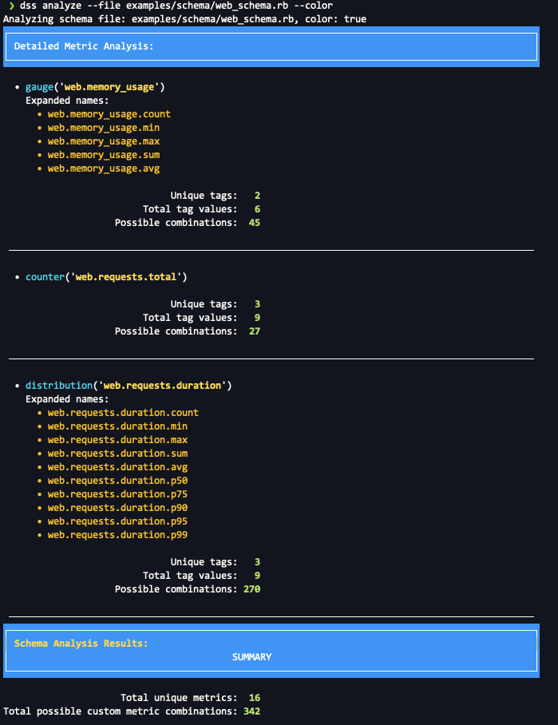

[](https://github.com/kigster/datadog-statsd-schema/actions/workflows/ruby.yml)

# Datadog StatsD Schema

A Ruby gem that provides comprehensive schema definition, validation, and cost analysis for Datadog StatsD metrics. This library helps teams prevent metric explosion, control costs, and maintain consistent metric naming conventions.

## Features

- **Schema Definition**: Define metric schemas with type safety and validation
- **Tag Management**: Centralized tag definitions with inheritance and validation
- **Cost Analysis**: Analyze potential custom metric costs before deployment
- **Metric Validation**: Runtime validation of metrics against defined schemas
- **CLI Tools**: Command-line interface for schema analysis and validation
- **Global Configuration**: Centralized configuration for tags and StatsD clients

## Installation

Add this line to your application's Gemfile:

```ruby
gem 'datadog-statsd-schema'
```

And then execute:

```bash
bundle install
```

Or install it yourself as:

```bash
gem install datadog-statsd-schema
```

## Quick Start

### Basic Schema Definition

```ruby
require 'datadog/statsd/schema'

# Define your metrics schema
schema = Datadog::Statsd::Schema.new do
  namespace :web do
    tags do
      tag :environment, values: %w[production staging development]
      tag :service, values: %w[api web worker]
      tag :region, values: %w[us-east-1 us-west-2]
    end

    metrics do
      counter :requests_total do
        description "Total HTTP requests"
        tags required: [:environment, :service], allowed: [:region]
      end

      gauge :memory_usage do
        description "Memory usage in bytes"
        tags required: [:environment], allowed: [:service, :region]
      end

      distribution :request_duration do
        description "Request processing time in milliseconds"
        tags required: [:environment, :service]
      end
    end
  end
end
```

### Using the Emitter with Schema Validation

```ruby
# Configure global settings
Datadog::Statsd::Schema.configure do |config|
  config.statsd = Datadog::Statsd.new('localhost', 8125)
  config.schema = schema
  config.tags = { environment: 'production' }
end

# Create an emitter with validation
emitter = Datadog::Statsd::Emitter.new(
  schema: schema,
  validation_mode: :strict  # :strict, :warn, or :disabled
)

# Send metrics with automatic validation
emitter.increment('web.requests_total', tags: { service: 'api', region: 'us-east-1' })
emitter.gauge('web.memory_usage', 512_000_000, tags: { service: 'api' })
emitter.distribution('web.request_duration', 45.2, tags: { service: 'api' })
```

## CLI Usage

The gem provides a command-line interface for analyzing schemas and understanding their cost implications.

### Installation

After installing the gem, the `dss` (Datadog StatsD Schema) command will be available:

```bash
dss --help
```

### Schema Analysis

Create a schema file (e.g., `metrics_schema.rb`):

```ruby
namespace :web do
  tags do
    tag :environment, values: %w[production staging development]
    tag :service, values: %w[api web worker]
    tag :region, values: %w[us-east-1 us-west-2 eu-west-1]
  end

  namespace :requests do
    metrics do
      counter :total do
        description "Total HTTP requests"
        tags required: [:environment, :service], allowed: [:region]
      end

      distribution :duration do
        description "Request processing time in milliseconds"
        inherit_tags "web.requests.total"
      end
    end
  end

  metrics do
    gauge :memory_usage do
      description "Memory usage in bytes"
      tags required: [:environment], allowed: [:service]
    end
  end
end
```

Analyze the schema to understand metric costs:

```bash
dss analyze --file metrics_schema.rb --color
```

**Output:**



This analysis shows that your schema will generate **342 custom metrics** across **16 unique metric names**. Understanding this before deployment helps prevent unexpected Datadog billing surprises.

## Advanced Features

### Tag Inheritance

Metrics can inherit tag configurations from other metrics to reduce duplication:

```ruby
namespace :api do
  metrics do
    counter :requests_total do
      tags required: [:environment, :service], allowed: [:region]
    end

    # Inherits environment, service (required) and region (allowed) from requests_total
    distribution :request_duration do
      inherit_tags "api.requests_total"
      tags required: [:endpoint]  # Adds endpoint as additional required tag
    end
  end
end
```

### Nested Namespaces

Organize metrics hierarchically with nested namespaces:

```ruby
namespace :application do
  tags do
    tag :environment, values: %w[prod staging dev]
  end

  namespace :database do
    tags do
      tag :table_name, values: %w[users orders products]
    end

    metrics do
      counter :queries_total
      distribution :query_duration
    end
  end

  namespace :cache do
    tags do
      tag :cache_type, values: %w[redis memcached]
    end

    metrics do
      counter :hits_total
      counter :misses_total
    end
  end
end
```

### Validation Modes

Control how validation errors are handled:

```ruby
# Strict mode: Raises exceptions on validation failures
emitter = Datadog::Statsd::Emitter.new(schema: schema, validation_mode: :strict)

# Warn mode: Logs warnings but continues execution
emitter = Datadog::Statsd::Emitter.new(schema: schema, validation_mode: :warn)

# Disabled: No validation (production default)
emitter = Datadog::Statsd::Emitter.new(schema: schema, validation_mode: :disabled)
```

### Global Configuration

Set up global defaults for your application:

```ruby
Datadog::Statsd::Schema.configure do |config|
  config.statsd = Datadog::Statsd.new(
    ENV['DATADOG_AGENT_HOST'] || 'localhost',
    ENV['DATADOG_AGENT_PORT'] || 8125
  )
  config.schema = schema
  config.tags = {
    environment: ENV['RAILS_ENV'],
    service: 'my-application',
    version: ENV['APP_VERSION']
  }
end

# These global tags are automatically added to all metrics
emitter = Datadog::Statsd::Emitter.new
emitter.increment('user.signup')  # Automatically includes global tags
```

## Cost Control and Best Practices

### Understanding Metric Expansion

Different metric types create different numbers of time series:

- **Counter/Set**: 1 time series per unique tag combination
- **Gauge**: 5 time series (count, min, max, sum, avg)
- **Distribution/Histogram**: 10 time series (count, min, max, sum, avg, p50, p75, p90, p95, p99)

### Tag Value Limits

Be mindful of tag cardinality:

```ruby
# High cardinality - avoid
tag :user_id, type: :string  # Could be millions of values

# Better approach - use bucketing
tag :user_tier, values: %w[free premium enterprise]
tag :user_cohort, values: %w[new_user returning_user power_user]
```

### Schema Validation

Always validate your schema before deployment:

```ruby
# Check for common issues
errors = schema.validate
if errors.any?
  puts "Schema validation errors:"
  errors.each { |error| puts "  - #{error}" }
end
```

## Integration Examples

### Sidekiq Job Monitoring

Imagine that we are building a Rails application, and we prefer to create our own tracking of the jobs performed, failed, succeeded, as well as their duration. 

> ![TIP] 
> A very similar approach would work for tracking eg. requests coming to the `ApplicationController` subclasses.

First, let's initialize the schema from a file (we'll dive into the schema a bit later):

```ruby
# config/initializers/datadog_statsd.rb
SIDEKIQ_SCHEMA = Datadog::Statsd::Schema.load_file(Rails.root.join('config/metrics/sidekiq.rb'))

Datadog::Statsd::Schema.configure do |config|
  config.statsd = Datadog::Statsd.new
  config.schema = SIDEKIQ_SCHEMA
  config.tags = {
    environment: Rails.env,
    service: 'my-rails-app',
    version: ENV['DEPLOY_SHA']
  }
end
```

#### Adding Statsd Tracking to a Worker

In this example, a job monitors itself by submitting a relevant statsd metrics:

```ruby
class OrderProcessingJob
  QUEUE = 'orders'.freeze

  include Sidekiq::Job
  sidekiq_options queue: QUEUE

  def perform(order_id)
    start_time = Time.current
    
    begin
      process_order(order_id)
      emitter.increment('order_processing.success')
    rescue => error
      emitter.increment(
        'order_processing.failure', 
        tags: { error_type: error.class.name }
      )
      raise
    ensure
      duration = Time.current - start_time
      emitter.distribution(
        'jobs.order_processing.duration', 
        duration * 1000
      )
    end
  end

  # Create an instance of an Emitter equipped with our metric
  # prefix and the tags.
  def emitter
    @emitter ||= Datadog::Statsd::Emitter.new(
      self, 
      metric: 'job', 
      tags: { queue: QUEUE }
    )
  end
end
```

The above Emitter will generate the following metrics: 

 * `job.order_processing.success` (counter)
 * `job.order_processing.failure` (counter)
 * `job.order_processing.duration.count`
 * `job.order_processing.duration.min`
 * `job.order_processing.duration.max`
 * `job.order_processing.duration.sum`
 * `job.order_processing.duration.avg`


However, you can see that doing this in each job is not practical. Therefore the first question that should be on our mind is — how do we make it so that this behavior would automatically apply to any Job we create?

#### Tracking All Sidekiq Workers At Once

The qustion postulated above is — can we come up with a class design patter that allows us to write this code once and forget about it?

**Let's take Ruby's metaprogramming for a spin.**

One of the most flexible methods to add functionality to all jobs is to create a module that the job classes include *instead of* the implementation-specific `Sidekiq::Job`.

So let's create our own module, let's call it `BackgroundWorker`, that we'll include into our classes instead. Once created, we'd like for our job classes to look like this:

```ruby
class OrderProcessingJob
  include BackgroundWorker
  sidekiq_options queue: 'orders'
  
  def perform(order_id)
    # perform the work for the given order ID
  end
end
```

So our module, when included, should:

* include `Sidekiq::Job` as well
* define the `emitter` method so that it's available to all Job instances
* wrap `perform` method in the exception handling block that emits corresponding metrics as in our example before.

The only tricky part here is the last one: wrapping `perform` method in some shared code. This used to require "monkey patching", but no more. These days Ruby gives us an all-powerful `prepend` method that does exactly what we need. 

Final adjustment we'd like to make is the metric naming.

While the metrics such as:

 * `job.order_processing.success` (counter)
 * `job.order_processing.failure` (counter)

are easy to understand, the question begs: do we really need to insert the job's class name into the metric name? Or — is there a better way?

The truth is — there is! Why create 7 unique metrics **per job** when we can simply submit the same metrics for all jobs, tagged with our job's class name as an "emitter" source?

#### Module for including into Backround Worker

So, without furether ado, here we go:

```ruby
module BackgroundWorker
  class << self
    def included(klass)
      klass.include(Sidekiq::Job)
      klass.prepend(InstanceMethods)
    end

    module InstanceMethods
      def perform(...)
        start_time = Time.current
        tags = {}
        error = nil

        begin
          super(...)
          emitter.increment("success")
        rescue => error
          tags.merge!({ error_type: error.class.name } )
          emitter.increment("failure", tags:)
          raise
        ensure
          duration = Time.current - start_time
          emitter.distribution(
            "duration", 
            duration * 1000,
            tags:
          )
        end
      end

      def emitter
        @emitter ||= Datadog::Statsd::Emitter.new(
          metric: 'sidekiq.job', 
          tags: { 
            queue: sidekiq_options[:queue], 
            job: self.class.name 
          }
        )
      end
    end
  end
end
```

> [!TIP]
> In a nutshell, we created a reusable module that, upon being included into any Job class, provides  reliable tracking of job successes and failures, as well as the duration. The duration can be graphed for all successful jobs by ensuring the tag `error_type` does not exist. 

So, the above strategy will generate the following metrics **FOR ALL** jobs:

The above Emitter will generate the following metrics: 

 * `sidekiq.job.success` (counter)
 * `sidekiq.job.failure` (counter)
 * `sidekiq.job.duration.count`
 * `sidekiq.job.duration.min`
 * `sidekiq.job.duration.max`
 * `sidekiq.job.duration.sum`
 * `sidekiq.job.duration.avg`

that will be tagged with the following tags:

* `queue:       ... `
* `job:         { 'OrderProcessingJob' | ... }`
* `environment: { "production" | "staging" | "development" }`
* `service:     'my-rails-app'`
* `version:     { "git-sha" }`

## Development

After checking out the repo, run:

```bash
bin/setup              # Install dependencies
bundle exec rspec      # Run Specs
bundle exec rubocop    # Run Rubocop
```

To install this gem onto your local machine:

```bash
bundle exec rake install
```

## Contributing

Bug reports and pull requests are welcome on GitHub at https://github.com/kigster/datadog-statsd-schema.

## License

The gem is available as open source under the terms of the [MIT License](https://opensource.org/licenses/MIT).
