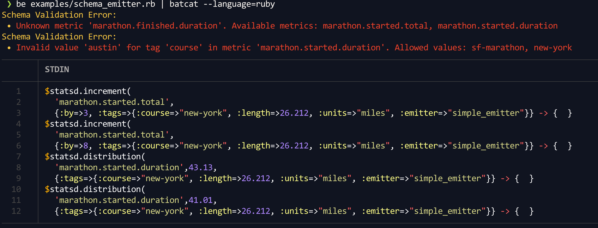

# Examples

To run the examples, inspect them first, then run from the project's root:

```bash
bundle install
bundle exec examples/simple_emitter.rb
```

This should print what would have been methods on $statsd instance (of type `Datadog::Statsd`)

Now let's run the schema example, which first sends several metrics that follow the schema, and then send one that does not:

```bash
bundle exec examples/schema_emitter.rb
```

Since the script prints parseable Ruby to STDOUT, and errors to STDERR, you could make the output a bit more colorful by installing a `bat` tool (on MacOS) or `batcat` on Linux:

## Linux

```bash
$ sudo apt-get update -yqq && sudo apt-get install batcat
```

## MacOS

```bash
brew install bat
```

And then you can run it like so:

```bash
# Linux
bundle exec examples/schema_emitter.rb | batcat --language=ruby

# MacOS
bundle exec examples/schema_emitter.rb | bat --language=ruby
```

You should see something like this:

]
